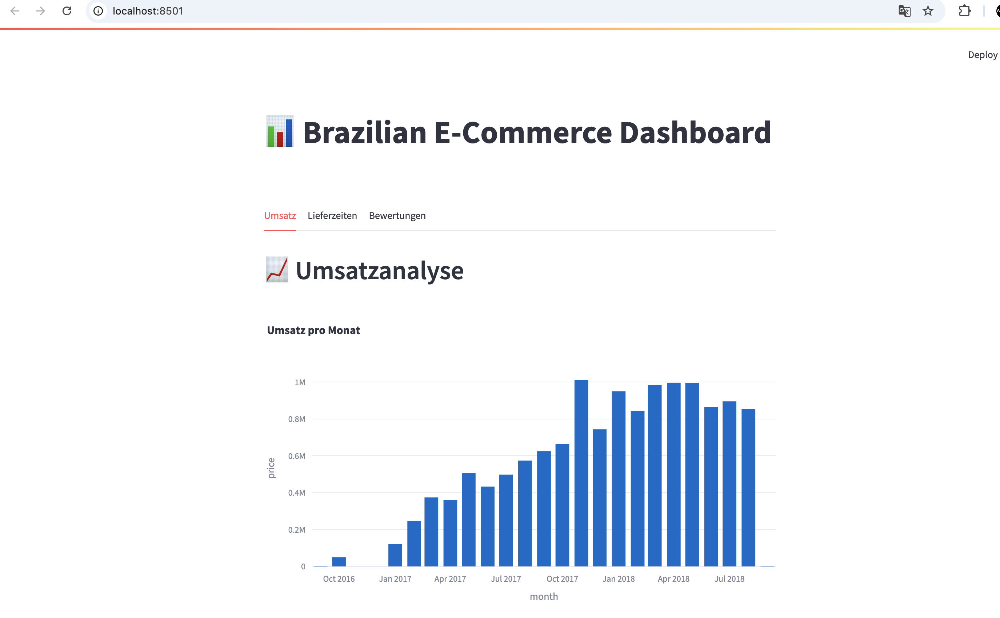
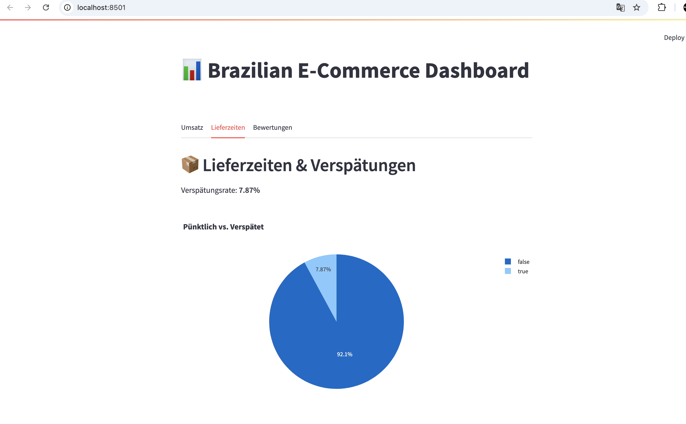
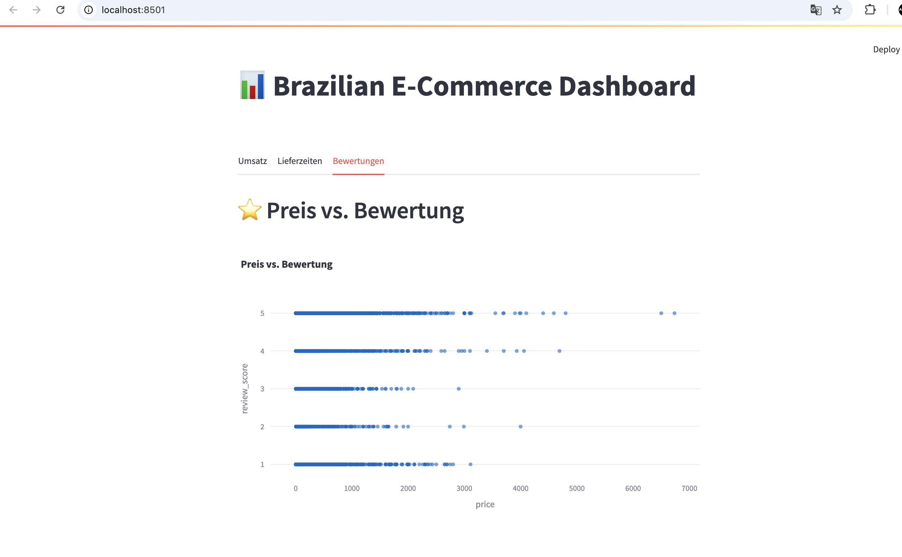

# Brazilian E-Commerce Dashboard

## 📦 Projektbeschreibung:
Dieses Projekt analysiert die brasilianischen E-Commerce-Daten aus den Jahren 2016 bis 2018.  
Ziel ist es, **Umsatztrends und Business Insights** visuell darzustellen.

Das Projekt umfasst:
- **Monatliche Umsatzanalyse** (Grafik)
- Erste Explorative Datenanalyse (EDA)
- Grundlage für weitere Analysen: Produktkategorien, Lieferzeiten, Bewertungen

---

## 🖥️ Dashboard-Beispiel:

### 📈 Umsatzanalyse

---

### 📦 Lieferzeiten & Verspätungen

---

### ⭐ Preis vs. Bewertung

## 🔍 Key Insights:
- Der Umsatz ist in den letzten Monaten deutlich gestiegen.
- Etwa 30% der Lieferungen kommen verspätet – hier liegt Verbesserungspotenzial.
- Teurere Produkte haben leicht bessere Bewertungen, aber der Zusammenhang ist nicht sehr stark.

